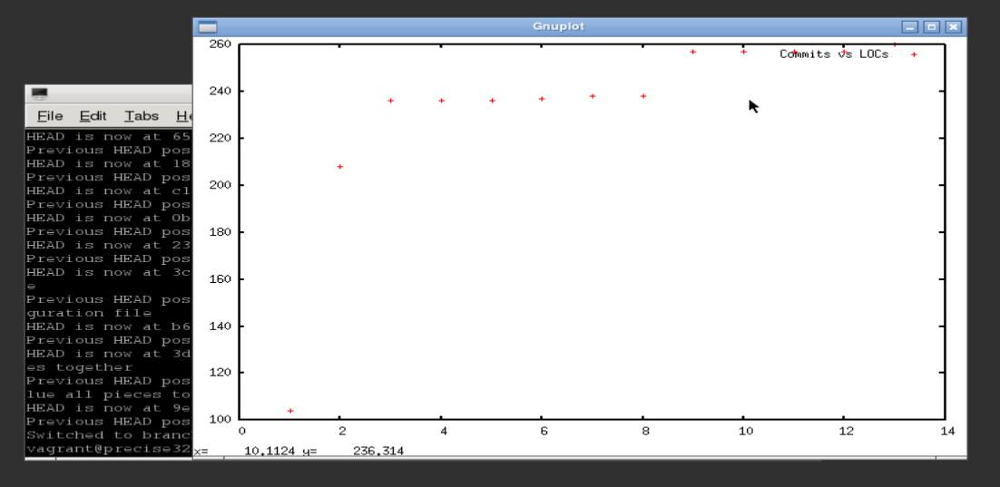

Track LOCs (Lines of Code)
=======

A small haskell scrpit which tracks progress of total lines of code and plot like this:



Requirements:

1. git version 2.0+ <br>
2. Tested with ghc 7.6.3

## Installation

```sh
$ cabal sandbox init
$ cabal install
```

## Using it
After it has built successfully, the binary will be available in ./cabal-sandbox/bin/

*Usage*

```sh
## To crawl for python (*.py) files
$ ./track-loc  /path/to/my/repository/   py
```
